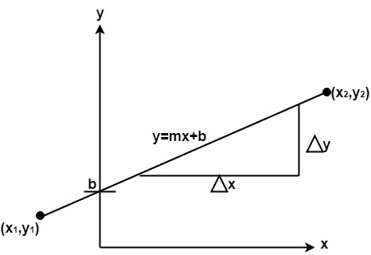

# Computer Graphics Algorithms
Computer Graphics involves technology to access. The Process transforms and presents information in a visual form. The role of computer graphics insensible. In today life, computer graphics has now become a common element in user interfaces, T.V. commercial motion pictures. 

Computer Graphics is the creation of pictures with the help of a computer. The end product of the computer graphics is a picture it may be a business graph, drawing, and engineering. 

In computer graphics, two or three-dimensional pictures can be created that are used for research. Many hardware devices algorithm has been developing for improving the speed of picture generation with the passes of time. It includes the creation storage of models and image of objects. These models for various fields like engineering, mathematical and so on.  

Today computer graphics is entirely different from the earlier one. It is not possible. It is an interactive user can control the structure of an object of various input devices. 

## Scan Convertion : 
It is a process of representing graphics objects a collection of pixels. The graphics objects are continuous. The pixels used are discrete. Each pixel can have either on or off state.

## Line Drawing Algorithms : 
A straight line may be defined by two endpoints & an equation. In fig the two endpoints are described by (x1,y1) and (x2,y2). The equation of the line is used to determine the x, y coordinates of all the points that lie between these two endpoints. 

Using the equation of a straight line, y = mx + b where m = Scan Converting a Straight Line & b = the y interrupt, we can find values of y by incrementing x from x =x1, to x = x2. By scan-converting these calculated x, y values, we represent the line as a sequence of pixels.

### 1. Digital Differential Analyzer Line Drawing Algorithm 
### 2. Bresenhams Line Drawing Algorithm

## Circle Generation Line Drawing Algorithm : 

### 1. Bresenhams Circle Generation Algorithm
### 2. Midpoint Circle Generation Algorithm

